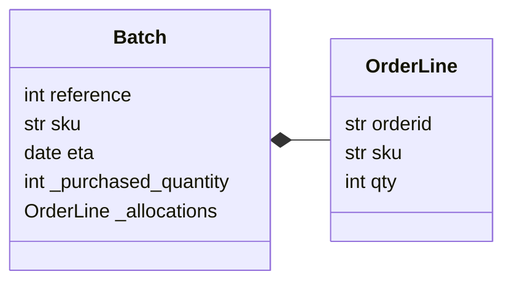

### Link
- [chap01. Domain Model Unit Test Example](https://github.com/cosmicpython/code/tree/chapter_01_domain_model_exercise)
- [chap01. Domain Model Unit Test](https://github.com/cosmicpython/code/tree/chapter_01_domain_model)

