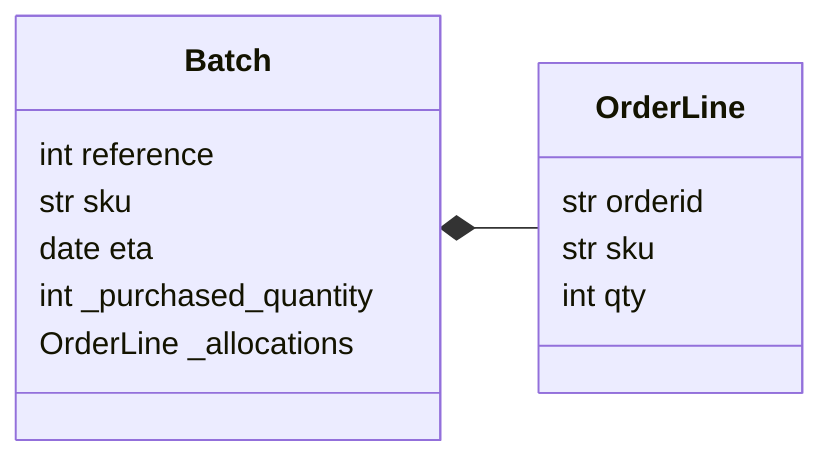

### Link
- [chap02. Repository](https://github.com/cosmicpython/code/tree/chapter_02_repository)
- [chap02. Repository Exercise](https://github.com/cosmicpython/code/tree/chapter_02_repository_exercise)

