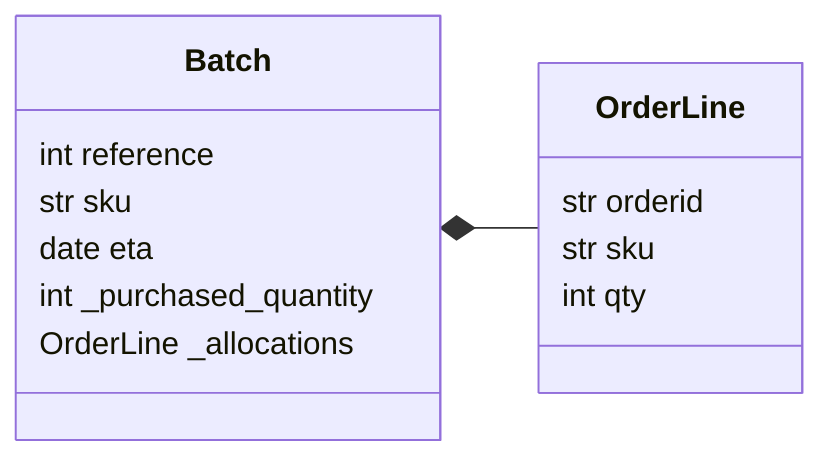

### Link
- [chap04. Service Layer](https://github.com/cosmicpython/code/tree/chapter_04_service_layer)
- [chap04. Service Layer Exercise](https://github.com/cosmicpython/code/tree/chapter_04_service_layer_exercise)

