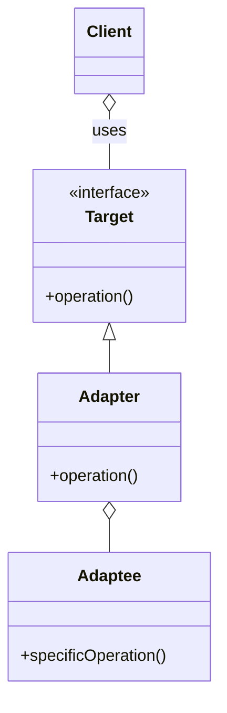

### Links
- [Let's Take The Adapter Design Pattern To The Next Level](https://www.youtube.com/watch?v=fsB8_79zI_A&ab_channel=ArjanCodes)
- [Github: 2022-adapter](https://github.com/ArjanCodes/2022-adapter)

